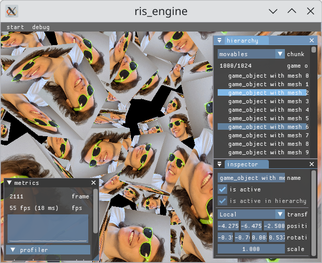

# ris_engine

Barebones game engine. Home made passion project.



## Features:

- [x] Startup, shutdown, mainloop and error handling
- [x] Logging, to console and file
- [x] Threadpool based concurrency
- [x] Remappable controls
  - [x] Mouse
  - [x] Keyboard
  - [x] Gamepad
- [x] 3d math
  - [x] Vectors and Matrices
  - [x] Quaternions
  - [x] Color
    - [x] RGB
    - [x] OkLab
- [x] Basic 3d renderer via Vulkan
- [x] Debugging
  - [x] GUI via Dear ImGui
  - [x] Profiling
  - [x] Gizmos
  - [x] const hashed string ids
- [x] Asset System
  - [x] Importing (convert raw assets to usable form)
  - [x] Loading (use in engine)
  - [x] (De)compiling
- [x] Codecs
  - [x] GLSL to SpirV, with custom pre processor
  - [x] QOI
  - [ ] glTF
- [x] Settings/Configuration
- [x] Gameobjects and components
  - [x] Mesh renderer
    - [ ] Materials
  - [x] Scripting
- [ ] Scene editing, saving and loading
- [ ] Collisions
- [ ] Animations
- [ ] 3d Sound

**Legend**:
- [x] implemented
- [ ] planned

## Requirements

|          |                          | Notes                                                    |
| -------- | ------------------------ | -------------------------------------------------------- |
| Compiler | rustc 1.77.2             | [Download Link](https://www.rust-lang.org/tools/install) |
| Platform | x86_64 Windows and Linux | may or may not compile on other platforms                |
| Graphics | Vulkan capable Hardware  |                                                          |

You also require an internet connection, to download dependencies from [crates.io](https://crates.io/). You can [vendor](https://doc.rust-lang.org/cargo/commands/cargo-vendor.html) crates for offline use or download an archived repo from [my website](https://www.rismosch.com/archive). Note that I make these archives sporadically, meaning they may not be up to date.

## Installation

This engine is using various 3rd party libraries. Trying to build without these will most definitely result in diverse compile, linker and runtime errors. Click to reveal the instructions for the given platform.

<details>
  <summary>Windows</summary>

  ### Windows

  The two required dependencies are [SDL2](https://www.libsdl.org/) and [Shaderc](https://github.com/google/shaderc). The easiest way install them is to install the [Vulkan SDK](https://vulkan.lunarg.com/). Installing the Vulkan SDK should also set up your environment correctly.

  If you don't want to install the Vulkan SDK, or you get build errors despite having it installed, follow the instructions below.

  #### 1. Get the necessary dependencies
  
  In this repo you will find the `./external/` directory, which contains all required binaries. If you don't trust the binaries in this repo, you must find and download them yourself. All following instructions assume you use the binaries provided in this repo.

  #### 2. Assign `SHADERC_LIB_DIR`

  [shaderc-rs](https://crates.io/crates/shaderc) requires the DLL `shaderc_shared.dll` during build time. shaderc-rs allows to store shader code inside Rust source files. ris_engine does not use this feature, but shaderc-rs requires this dependency regardless.
  
  shaderc-rs attempts to locate the DLL within the Vulkan SDK. If the Vulkan SDK is not installed, shaderc-rs searches the DLL in `SHADERC_LIB_DIR`. If this variable is not set, shaderc-rs will try to compile from source, which is quite slow and requires you to have C++ build tools installed.
  
  If you don't have the Vulkan SDK installed, set the environment variable `SHADERC_LIB_DIR` to `<repo>\external\Shaderc\bin`.

  #### 3. Make the LIBs available for your linker

  Rust needs to link. If you have the Vulkan SDK installed, then SDL2 and Shaderc should be able to find the required libs and you can skip this step. Otherwise continue reading.
  
  The four LIBs you need are:
   - `.\external\SDL2\lib\SDL2.lib`
   - `.\external\SDL2\lib\SDL2_test.lib`
   - `.\external\SDL2\lib\SDL2main.lib`
   - `.\external\Shaderc\lib\shaderc_shared.lib`

  When using `rustup`, the linker will search for LIBs in the directory below. Copy the LIBs above into this directory.

  ```powershell
  C:\Users\<your username>\.rustup\toolchains\<toolchain channel>\lib\rustlib\<current toolchain>\lib
  ```

  If you are not using `rustup`, you need to figure out how to link against these LIBs.

  #### 4. Add the DLLs to your environment

  If you have the Vulkan SDK installed and haven't done so already, add `<path to Vulkan SDK>\Bin` to `PATH`. Then you can skip this step. If you haven't installed the Vulkan SDK, continue reading.

  The two DLLs you need are
  - `.\external\SDL2\bin\SDL2.dll`
  - `.\external\Shaderc\bin\shaderc_shared.dll`
  
  The easiest way to make them available in your environment is to copy them to the root of this repo. This isn't recommended however, because they aren't tracked by git and thus are deleted whenever you clean this repo.

  I recommend to add `<repo>\external\SDL2\bin` and `<repo>\external\Shaderc\bin` to `PATH`.
  
  #### 5. Restart your terminal

  Make sure to restart your terminals, such that changes to your environment variables can take effect.

<details>
  <summary>Arch Linux</summary>
  
  ### Arch Linux
  
  #### 1. Install [SDL2](https://archlinux.org/packages/extra/x86_64/sdl2/)
  
  ```bash
  sudo pacman -S sdl2
  ```
  
  #### 2. Install [shaderc](https://archlinux.org/packages/extra/x86_64/shaderc/)
  
  ```bash
  sudo pacman -S shaderc
  ```
  
  #### 3. Install [Vulkan](https://wiki.archlinux.org/title/Vulkan)
  
  Depending on your graphics card, you need to install a different package. Follow the instructions in the link below:
  
  https://wiki.archlinux.org/title/Vulkan#Installation
</details>

## Building

Assuming everything is installed correctly, you can now compile and run the engine with:

```bash
cargo run
```

Alternatively, you can build a release-ready package, by running the command below. Note that this builds with all optimizations enabled, which may take longer than just using `cargo run`.

```bash
cargo run -p cli build
```

Passing the `-r` flag is discouraged, because asset discovery works differently in release builds. If you want to pass the `-r` flag to cargo, you must import and compile the assets manually. To do so, run the following two commands:

```bash
cargo run -p cli asset import
cargo run -p cli asset compile
```

After compiling, you will find the file `ris_assets` in the root of this repo. It contains all assets used by `ris_engine`.

## Testing

All tests are found under `./tests/` and can be run with:

```bash
cargo test
```

Alternatively, to run **much** more extensive tests, you can run the command below. Note that this may take several minutes.

```bash
cargo run -p cli pipeline all
```

Using the command above, some tests run [miri](https://github.com/rust-lang/miri). If miri is not installed, then the according tests will fail.

## Cli

For more info about the command `cargo run -p cli`, see [`./cli/README.md`](./cli/README.md).
